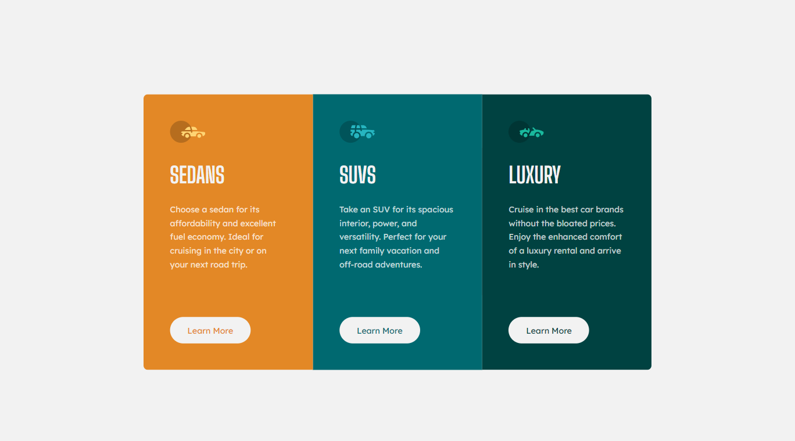

Frontend Mentor - 3-column preview card component solution

This is a solution to the [3-column preview card component challenge on Frontend Mentor](https://www.frontendmentor.io/challenges/3column-preview-card-component-pH92eAR2-). Frontend Mentor challenges help you improve your coding skills by building realistic projects.

## Table of contents

- [Table of contents](#table-of-contents)
- [Overview](#overview)
  - [The challenge](#the-challenge)
  - [Screenshot](#screenshot)
  - [Links](#links)
- [My process](#my-process)
  - [Built with](#built-with)
- [Author](#author)

## Overview

### The challenge

Users should be able to:

- View the optimal layout depending on their device's screen size
- See hover states for interactive elements

### Screenshot

### Links

- Solution URL: [Frontend Mentor](https://www.frontendmentor.io/solutions/3-column-preview-card-component-wmbHX5XzHp)
- Live Site URL: [GitHub Pages](https://oxyyz.github.io/3-col-preview-card-frontendmentor-solution/)

## My process

### Built with

- Semantic HTML5 markup
- CSS custom properties
- CSS Grid
- Sass/Scss

## Author

- Website - [Aziz Muradov](https://www.muradov.uz)
- Frontend Mentor - [@oxyyz](https://www.frontendmentor.io/profile/oxyyz)
- Twitter - [@thisismuradov](https://www.twitter.com/thisismuradov)
